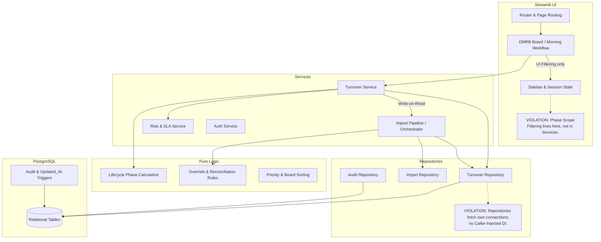

# Architecture Diagram

This diagram exposes the structural realities of the DMRB system, highlighting where architecture rules are bypassed and where hidden dependencies exist.

```mermaid
flowchart TD

subgraph Presentation_Layer [Streamlit UI]
    Router[Router & Page Routing]
    Sidebar[Sidebar & Session State]
    Board_UI[DMRB Board / Morning Workflow]
    SidebarNote["VIOLATION: Phase Scope<br/>Filtering lives here, not in Services."]
    Sidebar -.-> SidebarNote
end

subgraph Application_Layer [Services]
    TO_Svc[Turnover Service]
    Imp_Svc[Import Pipeline / Orchestrator]
    Risk_Svc[Risk & SLA Service]
    Auth_Svc[Auth Service]
    
    TO_Svc -- "Write-on-Read" --> Imp_Svc
end

subgraph Domain_Layer [Pure Logic]
    Life_Engine[Lifecycle Phase Calculation]
    Rules[Override & Reconciliation Rules]
    Priority[Priority & Board Sorting]
end

subgraph Data_Access [Repositories]
    TO_Repo[Turnover Repository]
    Imp_Repo[Import Repository]
    Audit_Repo[Audit Repository]
    RepoNote["VIOLATION: Repositories fetch own connections;<br/>no Caller-Injected DI."]
    TO_Repo -.-> RepoNote
end

subgraph Persistence [PostgreSQL]
    DB_Tables[(Relational Tables)]
    Triggers[Audit & Updated_At Triggers]
end

%% Actual Connections
Router --> Board_UI
Board_UI --> TO_Svc
Board_UI -- "UI Filtering only" --> Sidebar
TO_Svc --> Life_Engine
TO_Svc --> TO_Repo
TO_Svc --> Risk_Svc
Imp_Svc --> Rules
Imp_Svc --> TO_Repo
Imp_Svc --> Imp_Repo
TO_Repo --> DB_Tables
Audit_Repo --> DB_Tables
Triggers --> DB_Tables
```
