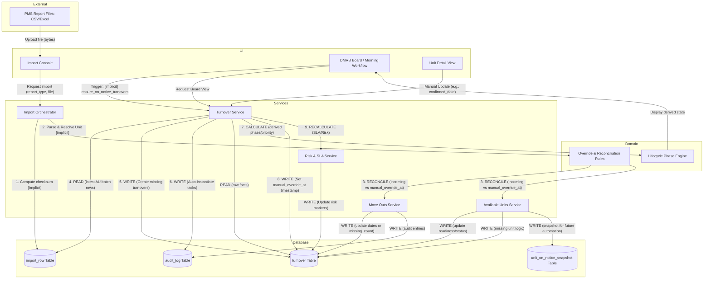

# Data Flow Diagram

This diagram illustrates the real-world movement of data through the DMRB system, highlighting the tension between external PMS reports and manual operational overrides, as well as the "Write-on-Read" side effects triggered by the UI.

