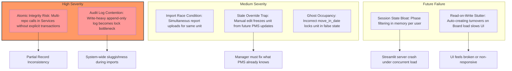

# Failure & Risk Diagram

This diagram ranks and visualizes the critical failure surfaces and scaling bottlenecks identified in the system forensic analysis.

```mermaid
flowchart TD

    subgraph Critical_Risks [High Severity]
        Atomic[Atomic Integrity Risk: Multi-repo calls in Services without explicit transactions]
        Scale_Audit[Audit Log Contention: Write-heavy append-only log becomes lock bottleneck]
    end

    subgraph Operational_Risks [Medium Severity]
        Race[Import Race Condition: Simultaneous report uploads for same unit]
        Override[Stale Override Trap: Manual edit freezes unit from future PMS updates]
        Ghost[Ghost Occupancy: Incorrect move_in_date locks unit in false state]
    end

    subgraph Scaling_Bottlenecks [Future Failure]
        Bloat[Session State Bloat: Phase filtering in memory per user]
        Stutter[Read-on-Write Stutter: Auto-creating turnovers on Board load slows UI]
    end

    %% Dependencies of failures
    Atomic --> Data_Corruption[Partial Record Inconsistency]
    Scale_Audit --> Write_Latency[System-wide sluggishness during imports]
    Override --> Manual_Burnout[Manager must fix what PMS already knows]
    Bloat --> Memory_OOM[Streamlit server crash under concurrent load]
    Stutter --> User_Abandonment[UI feels broken or non-responsive]

    style Critical_Risks fill:#f96,stroke:#333,stroke-width:2px
    style Atomic fill:#ff9999
    style Scale_Audit fill:#ff9999
```
