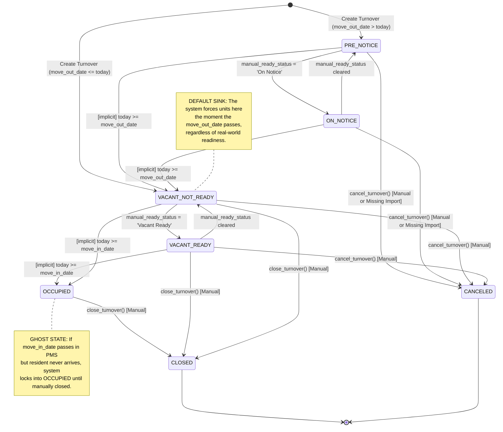

# State Machine Diagram

This diagram maps the computed lifecycle phases of a unit turnover, identifying the brittle dependencies on external dates and the "dead ends" created by terminal states.

```mermaid
stateDiagram-v2

    [*] --> PRE_NOTICE: Create Turnover (move_out_date > today)
    [*] --> VACANT_NOT_READY: Create Turnover (move_out_date <= today)

    PRE_NOTICE --> ON_NOTICE: manual_ready_status = 'On Notice'
    ON_NOTICE --> PRE_NOTICE: manual_ready_status cleared

    PRE_NOTICE --> VACANT_NOT_READY: [implicit] today >= move_out_date
    ON_NOTICE --> VACANT_NOT_READY: [implicit] today >= move_out_date

    VACANT_NOT_READY --> VACANT_READY: manual_ready_status = 'Vacant Ready'
    VACANT_READY --> VACANT_NOT_READY: manual_ready_status cleared

    VACANT_READY --> OCCUPIED: [implicit] today >= move_in_date
    VACANT_NOT_READY --> OCCUPIED: [implicit] today >= move_in_date

    OCCUPIED --> CLOSED: close_turnover() [Manual]
    VACANT_READY --> CLOSED: close_turnover() [Manual]
    VACANT_NOT_READY --> CLOSED: close_turnover() [Manual]

    PRE_NOTICE --> CANCELED: cancel_turnover() [Manual or Missing Import]
    ON_NOTICE --> CANCELED: cancel_turnover() [Manual or Missing Import]
    VACANT_NOT_READY --> CANCELED: cancel_turnover() [Manual]
    VACANT_READY --> CANCELED: cancel_turnover() [Manual]

    CLOSED --> [*]
    CANCELED --> [*]

    note right of OCCUPIED
        GHOST STATE: If move_in_date passes in PMS
        but resident never arrives, system
        locks into OCCUPIED until manually closed.
    end note

    note left of VACANT_NOT_READY
        DEFAULT SINK: The system forces units here
        the moment the move_out_date passes,
        regardless of real-world readiness.
    end note
```
