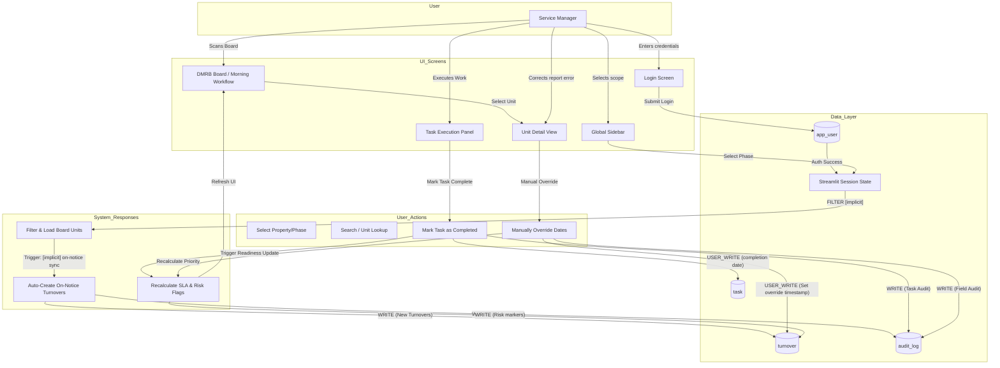

# User Data Flow Diagram

This diagram tracks the interactive journey of a Service Manager through the DMRB system, from authentication and scope selection to operational execution and manual data overrides.

