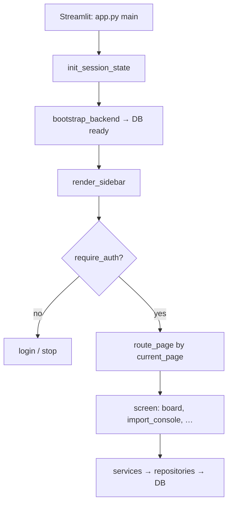
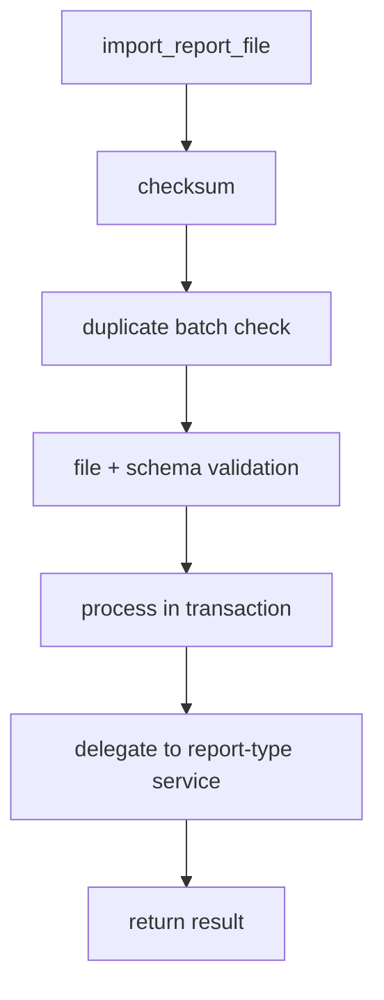

# DMRB Legacy — application flow

Vertical flowcharts for the Streamlit monolith (`dmrb/dmrb-legacy/`). Entry: `app.py` → `ui/router.py`, `ui/components/sidebar.py`, `ui/auth.py`, `ui/data/backend.py`, and import orchestration in `services/imports/orchestrator.py`.

---

## 1) Every Streamlit run (shell)

```
streamlit run app.py
        |
        v
   set_page_config
        |
        v
   init_session_state
   (auth, current_page, property_id, …)
        |
        v
   bootstrap_backend
        |
        v
   ensure_database_ready  (cached resource)
        |
        v
   render_sidebar
   (load properties → set property_id,
    nav buttons → set current_page + rerun,
    optional top flags from board/scope)
        |
        v
   route_page
        |
        +---- require_auth ----+
        |                      |
        |  not OK              |  OK
        v                      v
   login form / stop      dispatch screen
   (or open if no creds)  (see §2)
```

**Auth:** `ui/auth.py` + `config/settings.py`.

- **`AUTH_DISABLED`** (truthy): no login; `access_mode = full`.
- **`LEGACY_AUTH_SOURCE=env`** (default): if no `APP_*` / `VALIDATOR_*` pairs are configured, session is treated as authenticated (open). Otherwise login form; validator pair → `access_mode=validator_only`, admin pair → `full`.
- **`LEGACY_AUTH_SOURCE=db`:** login against `public.app_user` (migration `012_app_user.sql`); Argon2 verify via `services/auth_service.py`. On success: `authenticated`, `access_mode` from role (`validator` → `validator_only`, `admin` → `full`), `user_id`, `username`. **Admin → App users** tab (`ui/screens/admin.py`) creates users, changes passwords, roles, and active flag via `services/app_user_service.py` (requires **Enable DB Writes**).

---

## 2) After auth: which screen runs

`route_page()` reads `st.session_state["current_page"]` and calls one renderer. Default is **`board`**.

```
              route_page
                  |
                  v
         current_page value?
                  |
    +-------------+-------------+ … (many branches)
    |             |             |
    v             v             v
unit_detail   import_console   board (default)
import_reports  …             …
flag_bridge
add_turnover
property_structure
morning_workflow
risk_radar
ai_agent
work_order_validator
operations_schedule
admin
repair_reports
export_reports
```

Sidebar navigation (`ui/components/sidebar.py`) sets the same `page_key` strings that `ui/router.py` dispatches on.

---

## 3) Typical ops data path (conceptual)

Screens call **services**; services use **repositories** and DB **transactions**:

```
  Screen (ui/screens/…)
        |
        v
  Service (services/…)
        |
        v
  Repository (db/repository/…)
        |
        v
  Postgres (db/connection, migrations via bootstrap)
```

---

## 4) Import pipeline (report file)

From `services/imports/orchestrator.py` — `import_report_file()`:

```
  import_report_file(report_type, file_path, property_id)
        |
        v
  read bytes → checksum
        |
        v
  duplicate batch check (skip if COMPLETED; AVAILABLE_UNITS special case)
        |
        v
  validate_import_file
        |
        v
  validate_import_schema
        |
        v
  (transaction / batch creation — continues in module)
        |
        v
  route by report_type → MOVE_OUTS | PENDING_MOVE_INS |
                         AVAILABLE_UNITS | PENDING_FAS
        |
        v
  delegate to matching *_service
        |
        v
  result dict (status, counters, diagnostics)
```

---

## 5) Mermaid (top-to-bottom)

### App shell



### Import orchestration



---

## Summary

| Layer | Role |
|--------|------|
| **UI flow** | Configure app → session defaults → DB migrations → sidebar (property + page) → auth gate → one screen. |
| **Data flow** | Screen → service → repository → database. |
| **Import flow** | Checksum → dedupe → validate → transactional work → type-specific service → result. |
